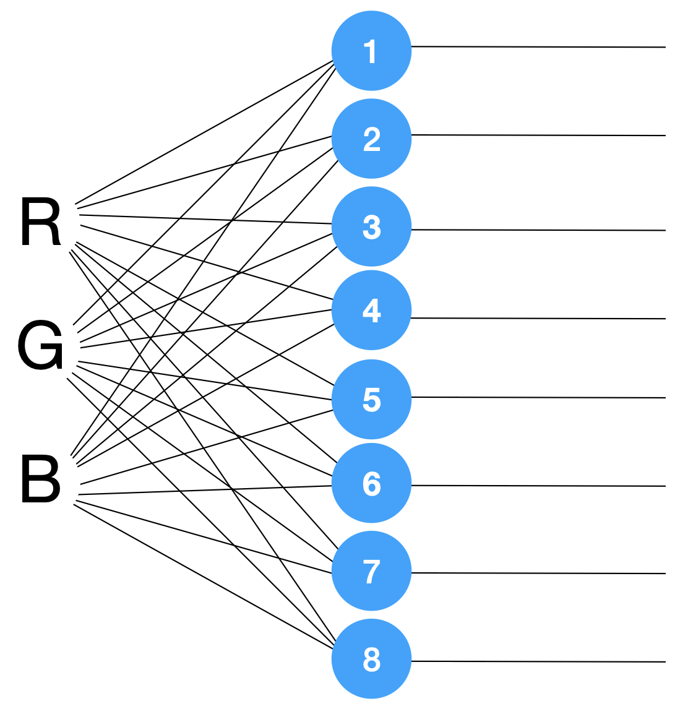

# Inteligência Artificial

## Teste Diagnóstico - Perceptrons

### GitHub

Este projeto pode ser observado no [GitHub](https://github.com/h80r/ia-colorful-perceptrons), onde também está disponível a versão em binário executável do projeto.

### Objetivo

Implementar computacionalmente uma rede neural perceptron que reconheça as seguintes cores: vermelho, verde, azul, preto, branco, amarelo, magenta e ciano.

### Entrada

- A entrada dessa rede neural consiste em três valores no intervalo [-1,+1].
- As entradas são referentes ao valores RGB e a camada de saída contém oito neurônios (não há camadas ocultas).

### Saída

- Cada neurônio da camada de saída representará uma cor (classe), conforme figura abaixo:
  - O neurônio 1 representa a cor vermelha;
  - 2 a cor verde;
  - 3 a cor azul;
  - 4 a cor preta;
  - 5 a cor branca;
  - 6 a cor amarela;
  - 7 a cor magenta;
  - 8 a cor ciano.

### Observações

- Utilize função de ativação linear nos neurônios.

Os padrões a serem utilizados no treinamento são:

- Vermelho:
  - Entradas = (+1.0, -1.0, -1.0);
  - Saídas (+1.0, -1.0, -1.0, -1.0, -1.0, -1.0, -1.0, -1.0)

- Verde:
  - Entradas: (-1.0, +1.0, -1.0);
  - Saídas (-1.0, +1.0, -1.0, -1.0, -1.0, -1.0, -1.0, -1.0)

- Azul:
  - Entradas = (-1.0, -1.0, +1.0);
  - Saídas (-1.0, -1.0, +1.0, -1.0, -1.0, -1.0, -1.0, -1.0)

- Preto:
  - Entradas = (-1.0, -1.0, -1.0);
  - Saídas (-1.0, -1.0, -1.0, +1.0, -1.0, -1.0, -1.0, -1.0)

- Branco: 
  - Entradas = (+1.0, +1.0, +1.0);
  - Saídas (-1.0, -1.0, -1.0, -1.0, +1.0, -1.0, -1.0, -1.0)

- Amarelo:
  - Entradas = (+1.0, +1.0, -1.0);
  - Saídas (-1.0, -1.0, -1.0, -1.0, -1.0, +1.0, -1.0, -1.0)

- Magenta: 
  - Entradas = (+1.0, -1.0, +1.0);
  - Saídas (-1.0, -1.0, -1.0, -1.0, -1.0, -1.0, +1.0, -1.0)

- Ciano:
  - Entradas = (-1.0, +1.0, +1.0);
  - Saídas (-1.0, -1.0, -1.0, -1.0, -1.0, -1.0, -1.0, +1.0)

Após treinada, a rede neural estará pronta para uso e deverá ser adotada uma estratégia chamada winner takes all. Esta estratégia ativa somente o neurônio mais estimulado, ou seja, o neurônio com valor mais elevado (valor pós função de ativação) dentre os oito da camada de saída terá saída +1.0 e todos os demais -1.0. Assim, garante-se que, independente dos valores RGB entrados, uma cor será retornada pela rede neural.
